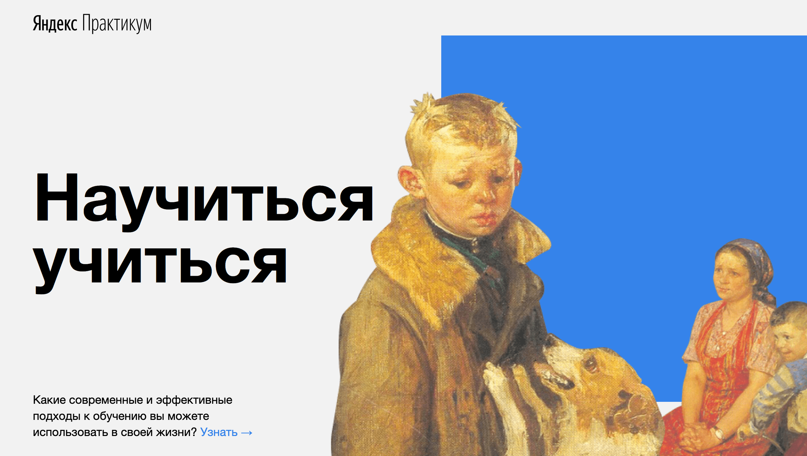

# Научиться учиться

Alt-H1
------

Научиться учиться – первая проектная работа в курсе веб-разработчик от Яндекс.Практикум. Её основная цель – закрепление знаний о верстке одностраничных сайтов, с использованием методологии БЭМ.

Работа над этим проектом включает в себя освоение таких практик как:
* БЭМ, как способ структуризации кода и его переиспользования
* Особенности позиционирования блоков, понятие потока
* Flexbox для создания сеток и выравнивания
* Использование семантических тегов в структуре сайта
* Медиафайлы - встраивание изображений и видео на сайт
* Интерактивность проекта - анимации и псевдоклассы для ссылок 💫

Alt-H1
------
Сейчас на странице собраны советы по организации работы во время обучения, интересные видео про прокрастинацию, ссылки на полезные ресурсы и другие вдохновляющие материалы. Вдохновляйтесь и вы! &rarr;
